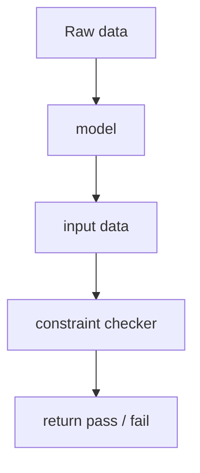

## Overview

Raw data
- hacktheclimate/data/processed/canonical_ie.csv

model
- unsure

input data
- taken from the model / raw data

constraint checker
- snsp
- thermal_limit
- asset_availability

return
- pass
- fail
