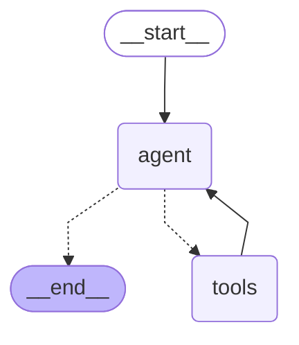

# Chat assistant graph

Generated by `graph --md`. Do not edit by hand.

## Tools available to the `tools` node

- `get_dispatch_down_forecast`: One-hour-ahead national dispatch-down risk for a single half-hour.
- `get_dispatch_down_day`: All 48 half-hourly dispatch-down predictions for the UTC day containing target_timestamp.
- `check_constraint`: National *constraint* (not total dispatch-down) forecast for a target time.
