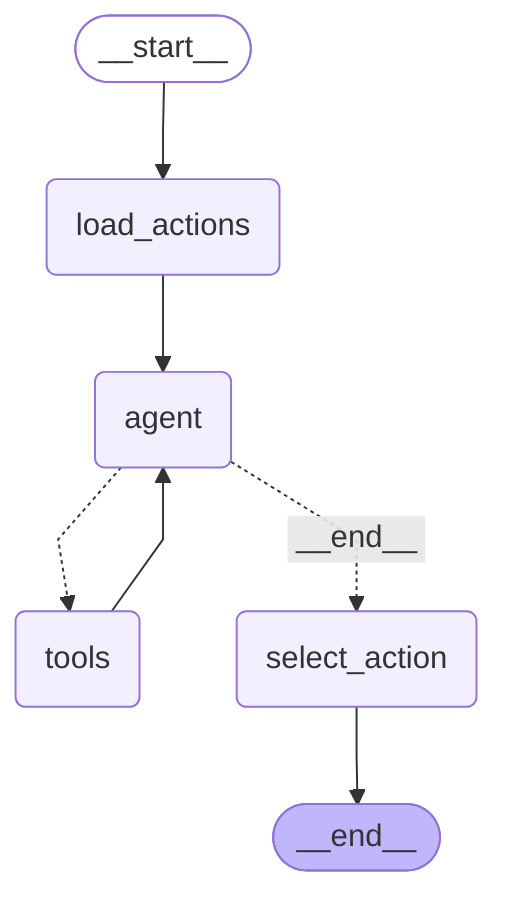

# Chat assistant graph

Generated by `graph --md`. Do not edit by hand.

## Tools available to the `tools` node

- `get_dispatch_down_forecast`: One-hour-ahead national dispatch-down risk for a single half-hour.
- `get_dispatch_down_day`: All 48 half-hourly dispatch-down predictions for the UTC day containing target_timestamp.
- `check_constraint`: Historical replay of national constraint (not total dispatch-down) for a target time.
- `get_current_constraint_forecast`: Checked experimental forward national constraint forecast for one future UTC half-hour.
- `get_current_constraint_day`: Summary of remaining half-hours in the current experimental national constraint forecast.
- `get_network_scenario`: Input-gated TYTFS planning-network DC scenario for one future UTC half-hour.
